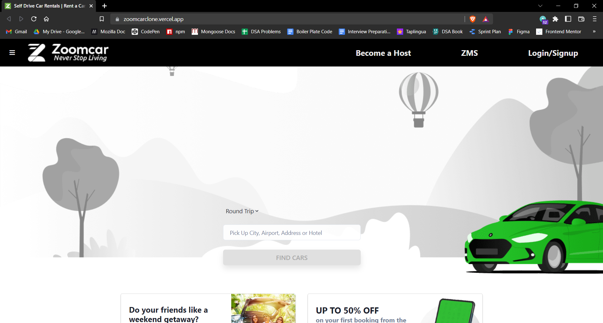
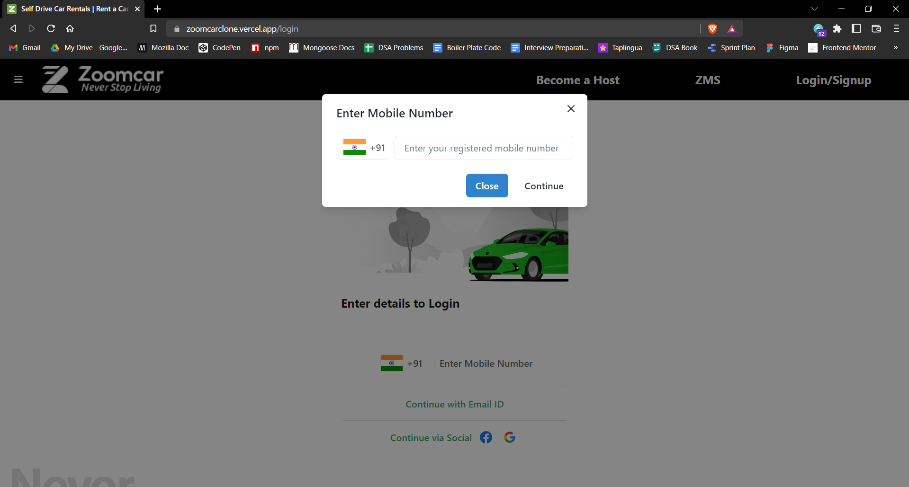
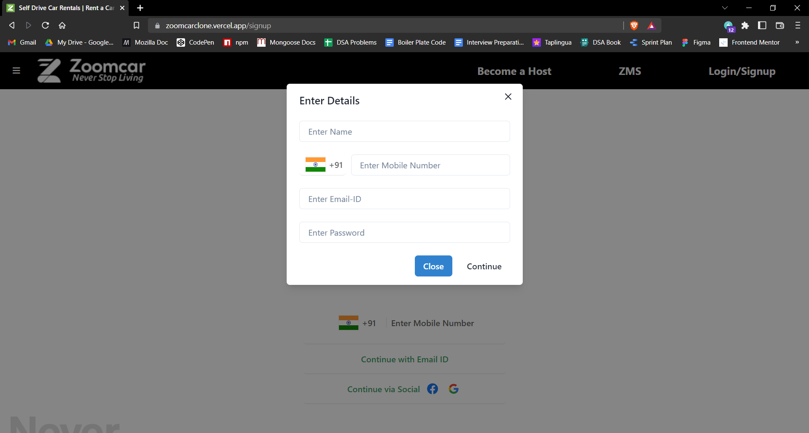
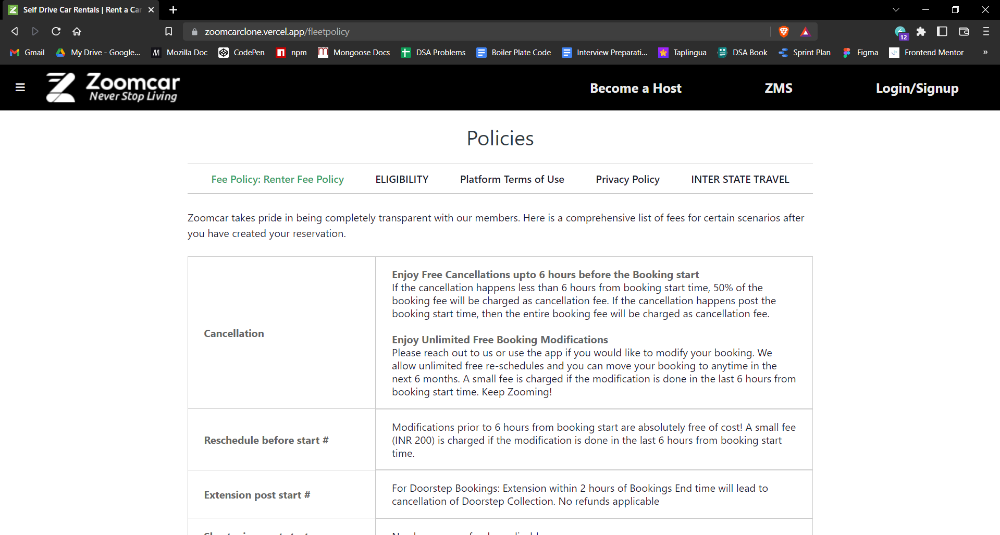
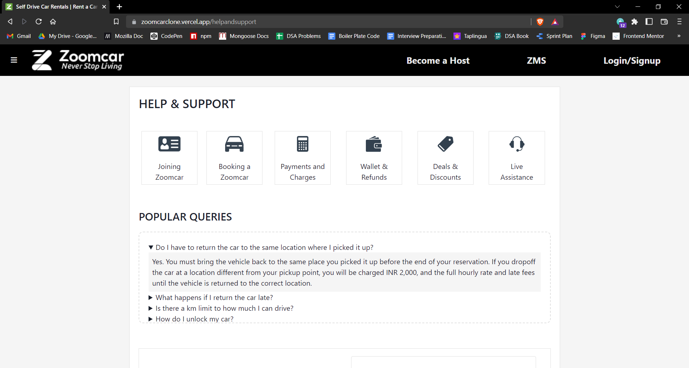

# Zoomcar Clone

Hello everyone, I'm Harshal Pardeshi builded a clone of `https://zoomcar.com/` in my construct week of Unit-4 at Masai School.

## Features

- Homepage with links to various sections.
- Login & signup pages with random otp feature and modal.
- Offcanas to left side.
- Help & support pages having popular queries.
- Policy pages.

## Screenshots

### 1. Home Page

### 2. Login Page

### 3. Signup Page

### 4. Policies Page

### 5. Help and support Page

## Tech Stack

In this project we used following tech stacks:- 
- [HTML](https://developer.mozilla.org/en-US/docs/Web/HTML)
- [CSS](https://developer.mozilla.org/en-US/docs/Web/CSS)
- [JS](https://developer.mozilla.org/en-US/docs/Web/JavaScript)
- [Bootstrap](https://getbootstrap.com/docs/5.2/getting-started/introduction/)
- [React](https://reactjs.org/)
- [Chakra UI](https://chakra-ui.com/getting-started)

## Connect with author

- [Twitter](https://twitter.com/harshal258)
- [LinkdIn](https://www.linkedin.com/in/harshalpardeshi/)

## Feedback

If you have any feedback or queries, please reach out to me at pardeshiharshal90@gmail.com.
